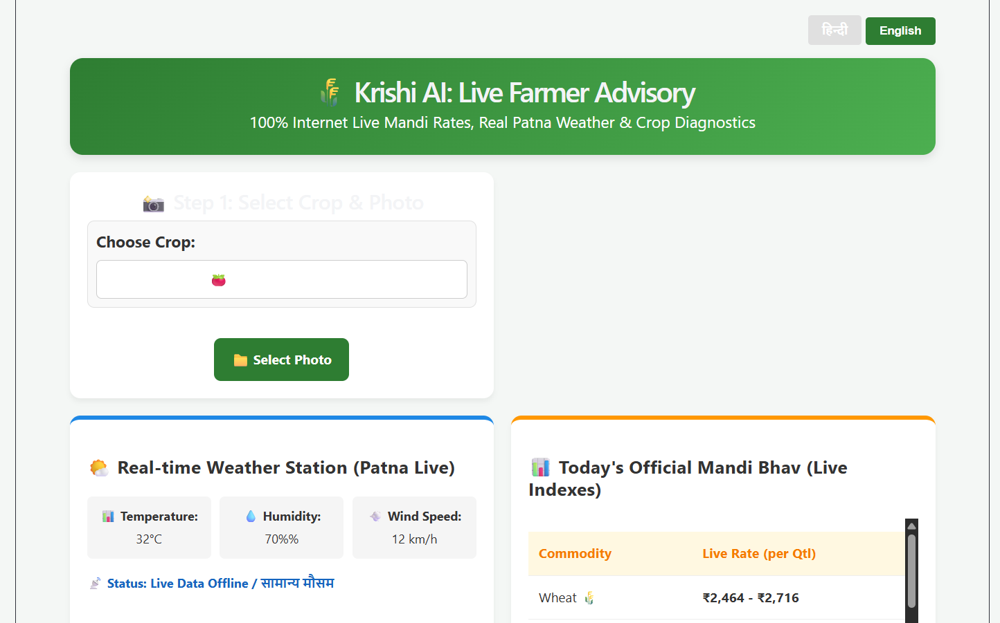

<div align="center">

# 🌾 Krishi Seva Center
### कृषि AI: लाइव किसान सेवा केंद्र

[](https://krishi-seva-center.vercel.app/)
[](https://tomato-disease-app-snqt.onrender.com)
[](https://github.com/Raj-Anmol)
[](https://www.linkedin.com/in/raj-anmol/)

**An AI-powered full-stack web application for Indian farmers — combining crop disease detection, live weather updates, real-time mandi prices, and bilingual (Hindi/English) farm advisory — all in one platform.**

</div>

---

## 📌 Project Overview

**Krishi Seva Center** is a farmer-first web application built to solve real agricultural challenges in India. It provides an intelligent, easy-to-use interface where farmers can upload crop photos to detect diseases, check live weather conditions for their region (Patna, Bihar), get real-time mandi commodity prices, and track their farm's health analytics — all accessible in both Hindi and English.

> *"Technology in the hands of every farmer, in their own language."*

---

## 📸 App Screenshot

<div align="center">



*Live view of the app showing Crop Selection, Real-time Patna Weather Station, and Today's Mandi Bhav (Live Commodity Prices)*

</div>

---

## 🌐 Deployment Links

| Service | URL |
|---|---|
| 🖥️ Frontend (Live App) | https://krishi-seva-center.vercel.app/ |
| ⚙️ Backend API | https://tomato-disease-app-snqt.onrender.com |
| 👨‍💻 GitHub Profile | https://github.com/Raj-Anmol |
| 💼 LinkedIn | https://www.linkedin.com/in/raj-anmol/ |

---

## ✨ Key Features

### 🔍 1. AI Crop Disease Detection
- Upload a crop photo and select your crop type
- Instantly receive disease name (in Hindi & English), confidence score, and treatment remedy
- Supports 8 major crops: Wheat, Rice, Cotton, Sugarcane, Maize, Tomato, Potato, Brinjal

### 🌤️ 2. Live Weather Station (Patna)
- Real-time weather data fetched from the **Open-Meteo API**
- Displays temperature, humidity, wind speed, and weather condition
- Includes a **Smart Agro Alert** warning farmers about bad weather conditions (e.g., stop pesticide spraying during rain/storms)

### 📊 3. Live Mandi Bhav (Commodity Prices)
- Daily commodity price index for 8 major crops
- Prices displayed in ₹/quintal format with dynamic fluctuations
- Helps farmers make informed selling decisions

### 📈 4. Farm Health Analytics
- Tracks total scans, healthy vs. diseased detections
- Visual health score with animated progress bar
- Persisted locally via browser storage across sessions

### 🌐 5. Bilingual Interface (Hindi / English)
- Full toggle between Hindi (हिंदी) and English
- All labels, alerts, results, and advisory content switch language seamlessly

### 🏪 6. Nearby Agri-Shop Locator
- Lists nearby agri input shops (fertilizer, pesticide, seed stores) with names and contact info
- Focuses on the Patna, Bihar region

### ❓ 7. FAQ Section
- Common farming questions answered in both languages
- Covers disease prevention, weather interpretation, and mandi price usage

### 📜 8. Scan History Log
- Maintains a session-based record of previous disease detections
- Shows crop type, detected disease, and timestamp

---

## 🛠️ Tech Stack

### Frontend
| Technology | Version | Purpose |
|---|---|---|
| React.js | ^19.2.6 | UI Framework |
| Vite | ^8.0.12 | Build Tool & Dev Server |
| Vanilla CSS | — | Custom Styling & Responsive Layout |
| React Hooks | useState, useEffect | State & Side-effect Management |

### Backend
| Technology | Purpose |
|---|---|
| Python | Core Language |
| FastAPI | REST API Framework |
| Uvicorn | ASGI Server |
| httpx | Async HTTP Client (for Open-Meteo API) |
| python-multipart | File Upload Handling |

### External APIs
| API | Usage |
|---|---|
| [Open-Meteo](https://open-meteo.com/) | Free real-time weather data (Patna coordinates) |

### Deployment
| Platform | Role |
|---|---|
| Vercel | Frontend hosting |
| Render | Backend API hosting |

---

## 📁 Project Structure

```
krishi-seva-center/
│
├── backend/
│   ├── main.py              # FastAPI app — weather, mandi, disease predict APIs
│   └── requirements.txt     # Python dependencies
│
├── frontend/
│   ├── public/
│   │   ├── favicon.svg
│   │   └── icons.svg
│   ├── src/
│   │   ├── assets/          # Static images (hero, react, vite SVGs)
│   │   ├── App.jsx          # Main React component (all features)
│   │   ├── App.css          # Complete styling
│   │   ├── index.css        # Global base styles
│   │   └── main.jsx         # React DOM entry point
│   ├── index.html
│   ├── package.json
│   ├── vite.config.js
│   └── eslint.config.js
│
└── .gitignore
```

---

## ⚙️ API Endpoints

| Method | Endpoint | Description |
|---|---|---|
| `GET` | `/api/weather` | Fetches live weather data for Patna from Open-Meteo |
| `GET` | `/api/mandi` | Returns today's commodity price index for 8 crops |
| `POST` | `/predict` | Accepts crop image + crop name, returns disease info |

### Sample `/predict` Response
```json
{
  "disease_en": "Tomato Early Blight",
  "disease_hi": "टमाटर का अगेती झुलसा रोग",
  "confidence": "97.43%",
  "remedy_en": "Apply organic copper fungicide.",
  "remedy_hi": "कॉपर फंगसीसाइड का छिड़काव करें।"
}
```

---

## 🚀 Getting Started (Local Setup)

### Prerequisites
- Node.js (v18+)
- Python (v3.10+)
- pip

### 1. Clone the Repository
```bash
git clone https://github.com/Raj-Anmol/krishi-seva-center.git
cd krishi-seva-center
```

### 2. Setup Backend
```bash
cd backend
pip install -r requirements.txt
python main.py
# Backend runs at: http://localhost:9000
```

### 3. Setup Frontend
```bash
cd frontend
npm install
npm run dev
# Frontend runs at: http://localhost:5173
```

---

## 🌱 Supported Crops

| Crop | Disease Detected | Remedy |
|---|---|---|
| 🌾 Wheat | Wheat Rust Disease | Propiconazole fungicide spray |
| 🌾 Rice | Bacterial Leaf Blight | Agrimycin solution |
| ☁️ Cotton | Bollworm Attack | Pheromone traps |
| 🎋 Sugarcane | Red Rot | Uproot & destroy infected canes |
| 🌽 Maize | Leaf Blight | Mancozeb fungicide |
| 🍅 Tomato | Early Blight | Copper fungicide |
| 🥔 Potato | Late Blight | Avoid overhead irrigation |
| 🍆 Brinjal | Little Leaf Disease | Neem-based insecticide |

---

## 📸 UI Highlights

- ✅ Clean, card-based responsive layout (mobile-friendly)
- ✅ Green-themed agricultural design (`#2e7d32`, `#4caf50`)
- ✅ Animated health progress bar
- ✅ Red alert banner for weather warnings
- ✅ Responsive grid for mandi price table
- ✅ Language switcher with active state highlight

---

## 🔮 Future Improvements

- [ ] Integrate a real CNN/ML model for disease detection (currently rule-based)
- [ ] Add GPS-based auto-location weather (not just Patna hardcoded)
- [ ] Connect to official government Agmarknet API for actual mandi prices
- [ ] Add push notifications for weather alerts
- [ ] PWA support for offline access in low-connectivity rural areas
- [ ] Add more regional languages (Bhojpuri, Maithili)

---

## 👨‍💻 Developer

<div align="center">

**Raj Anmol**  
*B.Tech Computer Science | AI & Cloud Computing Intern*  
*Edunet Foundation × AICTE × IBM SkillsBuild*

[](https://github.com/Raj-Anmol)
[](https://www.linkedin.com/in/raj-anmol/)

</div>

---

## 📄 License

This project is open source and available under the [MIT License](LICENSE).

---

<div align="center">

Made with ❤️ for the farmers of India 🇮🇳

*किसान की मुस्कान, हमारी पहचान।*

</div>